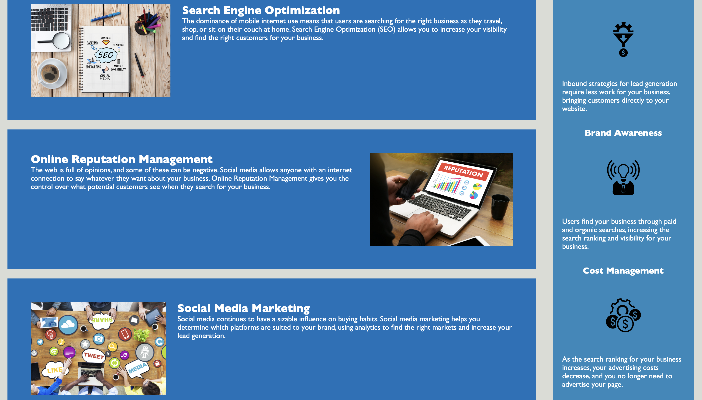

# Urban Octo Telegram Accessibility

## Repository

In this repository you will find the refactor code of a starter code. The purpose of refactoring the starter code for the Horiseon webpage was to make the webpage more accessible. Accessibility helps the page be more accessible and allowing people who use screen readers to enjoy the content of the webpage to its full potential. Throughout the proccess of refactoring the starter code I learned many things.

- When changing HTML tags to more semantic elements, you must also make sure the CSS file gets updated with the new tags otherwise the selectors will not match and will not apply any styles in the CSS code.
- Code that repeats itself in CSS can be consolidated by making a single class that styles multiple elements at the same time.
- Adding comments to the CSS file makes it easier to understand what the code is doing.

Those are just a few to say the least. Throughout this proccess I learned to work diligently to make the code better than when I first opened it. Something I kept in mind while making it more accessible was to make sure that none of my changes made the webpage look any different. In fact, it's in the definiton of "code refactoring". The goal is to restructure the code without changing its external behavior. Although I feel confident I made the code more accessible, I feel like there may still be things that can be done to make it even better. In the future I plan on implementing the new things I learn and come back to this project to see how I can imrpove upon my initial changes.

## Table of Contents

- [Contirbute](#contribute)
- [Appearance](#appearance)
- [Changes](#changes)
- [Features](#features)
- [Credits](#credits)
- [License](#license)

## Contribute

To view and contribute to my repository follow this link and clone the repository into your local repository [Urban Octo Telegram Accessibility Repository](https://github.com/lmansilla92/urban-octo-telegram-accessbility)

If you need help on how to clone a GitHub repository into your local repository, visit the following GitHub link: [Cloning a repository](https://docs.github.com/en/repositories/creating-and-managing-repositories/cloning-a-repository) 

## Appearance

When you first open the deplyed webpage the first thing you will see is this:
    

Once you scroll down you should see the following:
    

And last but not least the footer:
    

## Changes

The following changes were made to make the website more accessible:

- Added semantic elements to the HTML file by getting rid of the navs that didn't provide any semantic value.
- Used articles, sections, and aside to give meaning to the different sections of the page.
- Edited the divs in the CSS to match the new elements in the HTML so that the styles were applied properly.
- Consolidated classes to multiple elements that shared the same style.
- Added alt attributes to all the images.
- Used nav to wrap the ul and li in the header.
- Made sure all the headings were in sequential order in the index html file.

## Features

Although it's a simple page, the navigational links have a helpful feature. By using anchor tags that have a direct path to certain parts of the html file, you can click on one of the nav links and it will automatically scroll to the part of the page that relates to the link you clicked on. Exactly how the table of contents in this readme file works!

## Credits

Link to the starter code repository: [Urban Octo Telegram](https://github.com/coding-boot-camp/urban-octo-telegram)

## License
Link to [The MIT License (MIT)](https://github.com/lmansilla92/urban-octo-telegram-accessbility/blob/main/LICENSE)